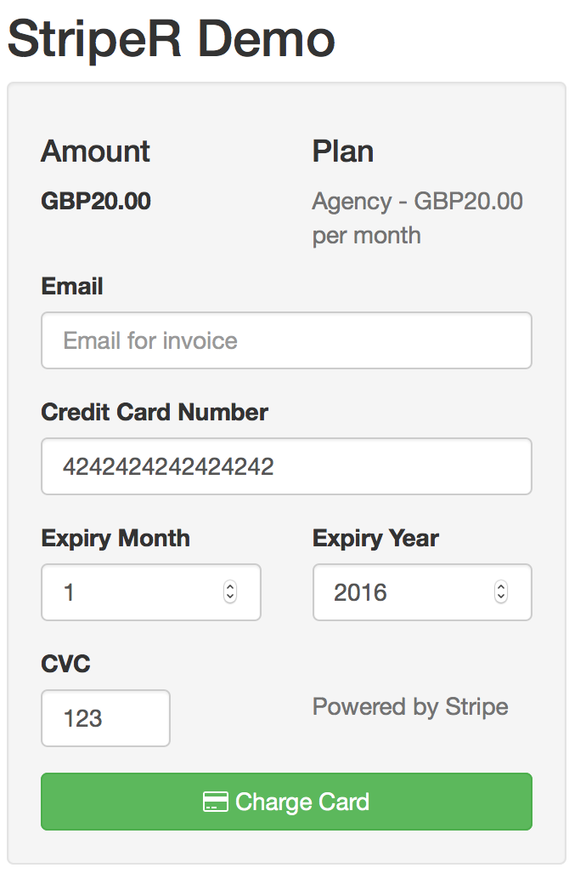

# stripeR

[](https://travis-ci.org/MarkEdmondson1234/stripeR)

An interface with the [Stripe](https://stripe.com) API for user payments.

[API docs](https://stripe.com/docs/api/curl)

## Setup

1. Sign up for a [Stripe account](https://dashboard.stripe.com/register) and get your API keys.  You will need to add a bank account and await approval.
2. Load stripeR() package then set your API keys.  **Protect your live API keys!!** - people could charge your card otherwise.

`stripeR` loads your API keys from a `.Renviron` file which you can place in your home directory.  This keeps it away from github for example. 

e.g.

```r
## in ~/.Renviron
stripeR.secret_test = SECRET_TEST_KEY
stripeR.public_test = PUBLIC_TEST_KEY
stripeR.secret_live = SECRET_LIVE_KEY
stripeR.public_live = PUBLIC_LIVE_KEY

```

This is then called on the library loading via its options: 
 
```r
stripeR.secret_test = Sys.getenv("stripeR.secret_test"),
stripeR.public_test = Sys.getenv("stripeR.public_test"),
stripeR.secret_live = Sys.getenv("stripeR.secret_live"), 
stripeR.public_live = Sys.getenv("stripeR.public_live") 
```

..and then accessible via `getOption`, e.g. `getOption("stripeR.secret_test")`

Then if for any reason you need to change this at run time you can via `options("stripeR.secret_test") <- "NEW_SECRET_KEY"` and not affect the environmental keys. 

The tests codes are ok to publish as they can't charge against a card. 

# Using the library

Before any `stripeR` session initialise using the `stripeR_init()` command.  Set to `TRUE` when you are ready to test against your live account.  It defaults to `FALSE`.

e.g.

```r
library(stripeR)

stripeR_init(live=FALSE)

## Check the balance of your Stripe account.
balance()

## Create a token you keep instead of customer details
token <- create_card_token(number=4242424242424242, 
                           exp_month=12, 
                           exp_year=2017, 
                           cvc=123, 
                           name = "Mark E")

## charge a card €1
charge_details <- charge_card(amount = 100, 
                              currency = "eur", 
                              source = token$id, 
                              # ensure only this API call makes a charge
                              idempotency=idempotency(), 
                              receipt_email="mark@buyme.com",
                              description = "Nice stuff")


```

## With Shiny

Some helper functions to make a payment form are enabled.  



Use as below:

```r

## server.R
library(shiny)
library(stripeR)

function(input, output, session){

  callModule(stripeRShiny, "stripe1",
             amount=2000,
             plan="example",
             formAmount=reactive("$20.00"),
             formText=reactive("Please pay $20.00"))

}
```

```r
## ui.R
library(shiny)
library(stripeR)

fluidPage(

  titlePanel("StripeR Demo"),

  # A Stripe Form
  sidebarLayout(
    sidebarPanel(
      stripeRShinyUI("stripe1")
    ),

    mainPanel(
      
    )
  )
)
